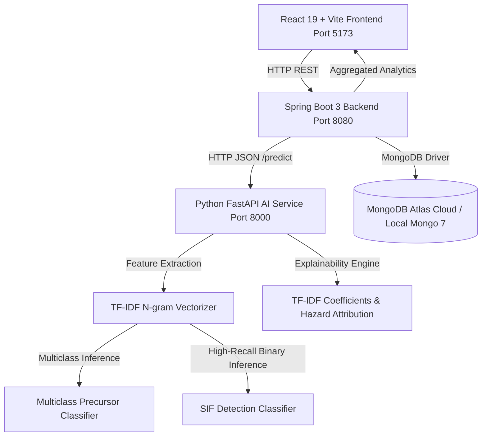

# AI/NLP Engine to Detect Serious Injury & Fatality (SIF) Precursors in Safety Reports

**Smart India Hackathon (SIH) – Software Edition Prototype**

## 1. Problem Statement

**"AI/NLP Engine to Detect Serious Injury & Fatality (SIF) Precursors in OIL's Unsafe-Act/Unsafe-Condition and Near-Miss Reports."**

In industrial energy operations (oil exploration, drilling, refining, and gas compression), traditional safety reporting often drowns safety officers in minor observations while failing to highlight low-frequency, high-consequence events that precede fatal incidents. This prototype delivers an automated early-warning and decision-support NLP engine to detect SIF precursors, classify them into standardized Life-Saving Rules categories, calibrate risk levels, and provide transparent model-derived explanations.

---

## 2. End-to-End System Architecture



---

## 3. Dataset & Grounding
* **Raw Dataset**: 105,996 real safety reports from OSHA Severe Incident & Injury Repository (2015–2025), including 2,750 oil & gas extraction and support operations records (NAICS 211xxx / 213111 / 213112).
* **Text Field**: Final Narrative (0 missing values, rich descriptions of equipment, actions, and environmental conditions).
* **Target Derivation**:
  * Multiclass Precursor: Mapped into 8 established industrial Life-Saving Rule families (FALL_FROM_HEIGHT, ELECTRICAL_HAZARDOUS_ENERGY, CONFINED_SPACE_HAZMAT, FIRE_EXPLOSION, CAUGHT_IN_BETWEEN, STRUCK_BY, VEHICLE_MOBILE_EQUIPMENT, OTHER).
  * Binary SIF Precursor: Based on Campbell Institute safety standards (high-energy hazards, fatal potential, life-altering trauma).

---

## 4. Machine Learning Methodology & Actual Evaluation
* **Text Cleaning**: Custom tokenizer preserving critical safety negation and condition tokens (without, no, not, never, unprotected, missing).
* **Feature Extraction**: TF-IDF vectorizer (unigrams + bigrams, sublinear TF scaling, 12,000 features).
* **Models**:
  1. Multiclass Precursor Classifier: Logistic Regression (L-BFGS, balanced class weights).
  2. Binary SIF Classifier: Logistic Regression with high-recall class weighting ({0: 1.0, 1: 1.8}) to prioritize recall and minimize dangerous false negatives.

### Real Evaluated Metrics (Holdout Test Set: 5,007 records)
* **Multiclass Precursor Classification**:
  * Accuracy: **82.64%**
  * Electrical Hazardous Energy F1: **0.91** (Precision: 0.97, Recall: 0.86)
  * Fire / Explosion F1: **0.90** (Precision: 0.91, Recall: 0.88)
  * Confined Space Hazmat F1: **0.88** (Precision: 0.95, Recall: 0.83)
  * Fall from Height F1: **0.85** (Precision: 0.85, Recall: 0.86)
* **Binary SIF Detection**:
  * Accuracy: **91.23%**
  * SIF Class Recall (Safety Critical): **91.84%**
  * SIF Class Precision: **90.16%**
  * SIF Class F1-Score: **90.99%**
  * False Negatives: Only 197 out of 2,415 high-risk incidents.

---

## 5. Explainability & Transparent Attribution
Instead of opaque black-box predictions, the AI service calculates:
1. **Feature Contributions**: Multiplies active TF-IDF weights by the logistic regression coefficients for the predicted class.
2. **Key Detected Factors**: Maps active features to verified hazard factors (e.g. *work at height*, *absence of tie-off/harness*).
3. **Potential Consequences & Actions**: Prescribes verified Life-Saving Rule controls for the identified hazard.

---

## 6. Project Structure 

```
SIF-X-AI-POWERED-SAFETY-INTELLIGENCE-AND-EARLY-WARNING-SYSTEM/
├── frontend/          # React + Vite user interface
├── backend/           # Spring Boot REST API and MongoDB Atlas repository
├── ai-service/        # Python FastAPI AI/NLP inference service
├── docker-compose.yml # Local MongoDB 7 container configuration
├── README.md          # Project documentation
└── .gitignore         # Git ignored files
```

---

## 7. How to Run Locally

### 1. MongoDB Database (Port 27017)
Run the local MongoDB 7 instance via Docker Compose:
```bash
docker-compose up -d
```
Alternatively, configure `MONGODB_URI` in `backend/src/main/resources/application.properties` pointing to your MongoDB Atlas cluster.

### 2. Python AI Service (Port 8000)
```bash
cd ai-service
python main.py
```

### 3. Spring Boot Backend (Port 8080)
```bash
cd backend
mvn spring-boot:run
```

### 4. React Frontend (Port 5173)
```bash
cd frontend
npm run dev
```

Open browser at: `http://localhost:5173`

---

## 8. MongoDB Atlas Production Setup (Render)

1. **Cluster Creation**: Create an M0 free tier (or dedicated) cluster in MongoDB Atlas.
2. **Dedicated User**: Create a database user with `readWrite` access restricted to the application database (e.g., `sifdb` or `sif_safety_db`). Use a strong, generated password.
3. **URL Encoding**: If your database password contains special characters (`@`, `:`, `/`, `%`, `+`), ensure they are URL-encoded in the connection string.
4. **Network Access**:
   * Render free tier web services do not have static outbound IP addresses. In MongoDB Atlas, go to **Network Access** -> **IP Access List** and add `0.0.0.0/0` (Allow Access from Anywhere).
   * Security is enforced via TLS encryption in transit and database username/password authentication.
   * On paid Render plans with static outbound IPs, you can replace `0.0.0.0/0` with your dedicated outbound IP for tighter allowlisting.
5. **Environment Variables on Render**:
   * Set `MONGODB_URI` to your `mongodb+srv://...` connection string. Never commit connection strings containing passwords to Git.
   * Set `AI_SERVICE_URL` to your deployed FastAPI web service URL on Render.
   * Set `SEED_DEMO_DATA=false` in production to prevent mock benchmark cases from re-seeding.

---

## 9. Decision Support Disclaimer
This system is an **early-warning and decision-support prototype**, NOT a system predicting guaranteed fatalities. All flagged precursor alerts require review by qualified HSE professionals.

## 10. Production Deployment (Render + MongoDB Atlas)
Cluster: create an M0 (free) or dedicated cluster in MongoDB Atlas.
Dedicated user: readWrite only on the application database (e.g. sifdb), with a strong generated password.
URL-encode special characters (@ : / % +) in the password within the connection string.
Network access: Render's free tier has no static outbound IP, so add 0.0.0.0/0 under Network Access → IP Access List.
Protection comes from TLS in transit plus username/password authentication.
On paid Render plans with a static IP, replace 0.0.0.0/0 with that IP.
Environment variables on Render:
Variable	Value
MONGODB_URI	mongodb+srv://... (never commit this to Git)
AI_SERVICE_URL	URL of the deployed FastAPI service
SEED_DEMO_DATA	false in production, to stop mock benchmark cases re-seeding

⏱️ Render free-tier services sleep after inactivity. Open the live link a minute before your demo to wake all three services.

https://sif-x-ai-powered-safety-intelligence-and-xldv.onrender.com
